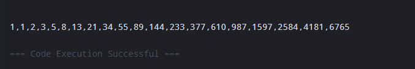

# Homework1
```java
public class Homework1 {
    public static void main(String[] args) {
        int size = 10; 

      
        System.out.println("");
        for (int i = 1; i <= size; i++) {
            for (int j = 1; j <= i; j++) {
                System.out.print("#");
            }
            System.out.println();
        }

        
        System.out.println("\n");
        for (int i = size; i >= 1; i--) {
            for (int j = 1; j <= i; j++) {
                System.out.print("#");
            }
            System.out.println();
        }

       
        System.out.println("\n");
        for (int i = 1; i <= size; i++) {
           
            for (int j = 1; j <= size - i; j++) {
                System.out.print(" ");
            }
            
            for (int k = 1; k <= i; k++) {
                System.out.print("#");
            }
            System.out.println();
        }

        
        System.out.println("\n");
        for (int i = size; i >= 1; i--) {
            
            for (int j = 1; j <= size - i; j++) {
                System.out.print(" ");
            }
           
            for (int k = 1; k <= i; k++) {
                System.out.print("#");
            }
            System.out.println();
        }
    }
}
```


# Homework2
```java
public class Homework2 {
    public static void main(String[] args) {
        int n = 20;
        long[] fib = new long[n];

        fib[0] = 1;
        fib[1] = 1;

        for (int i = 2; i<n;i++){
            fib[i] = fib[i-1]+fib[i-2];
        }

        System.out.println("");
        for(int i=0;i<n;i++){
            System.out.print(fib[i]+(i==n-1?"":","));
        }
        System.out.println();
    }
}


```



```

