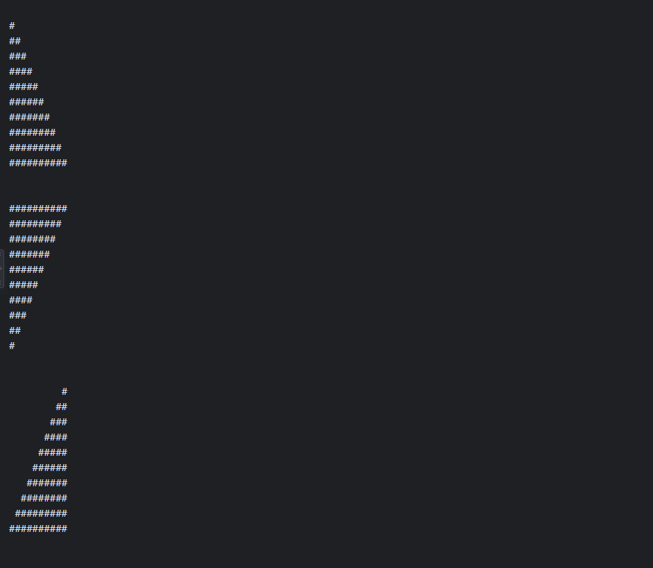

# Homework1
```java
public class Homework1 {
    public static void main(String[] args) {
        int size = 10; 

      
        System.out.println("");
        for (int i = 1; i <= size; i++) {
            for (int j = 1; j <= i; j++) {
                System.out.print("#");
            }
            System.out.println();
        }

        
        System.out.println("\n");
        for (int i = size; i >= 1; i--) {
            for (int j = 1; j <= i; j++) {
                System.out.print("#");
            }
            System.out.println();
        }

       
        System.out.println("\n");
        for (int i = 1; i <= size; i++) {
           
            for (int j = 1; j <= size - i; j++) {
                System.out.print(" ");
            }
            
            for (int k = 1; k <= i; k++) {
                System.out.print("#");
            }
            System.out.println();
        }

        
        System.out.println("\n");
        for (int i = size; i >= 1; i--) {
            
            for (int j = 1; j <= size - i; j++) {
                System.out.print(" ");
            }
           
            for (int k = 1; k <= i; k++) {
                System.out.print("#");
            }
            System.out.println();
        }
    }
}


```

