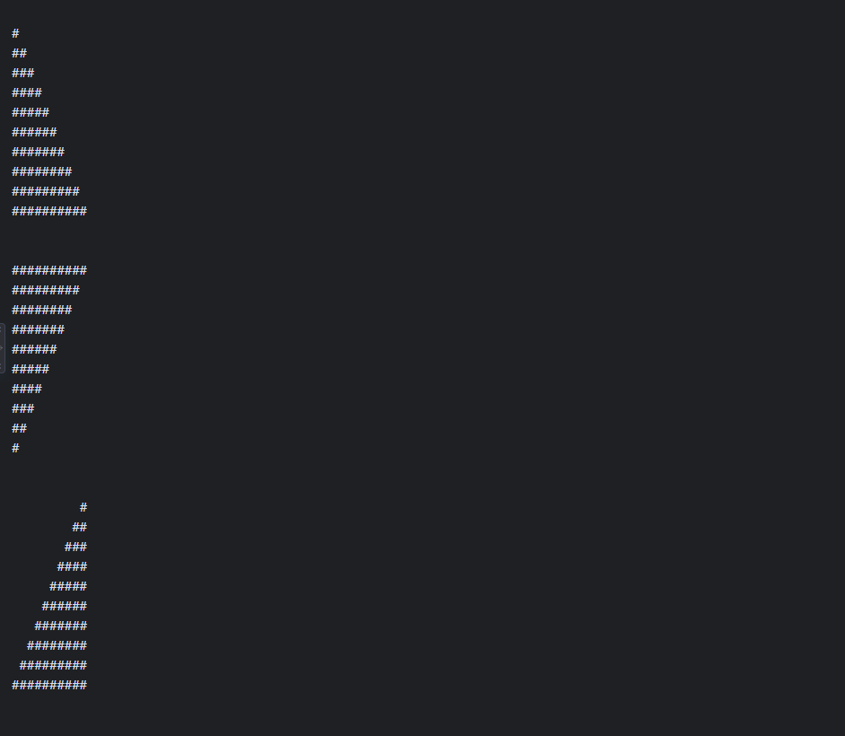
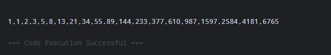
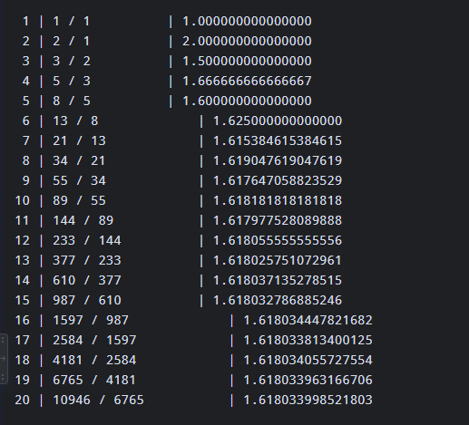
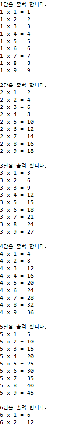
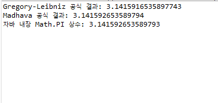
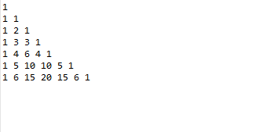
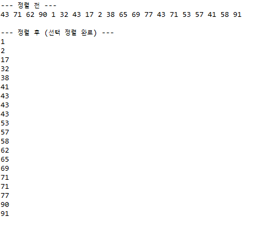
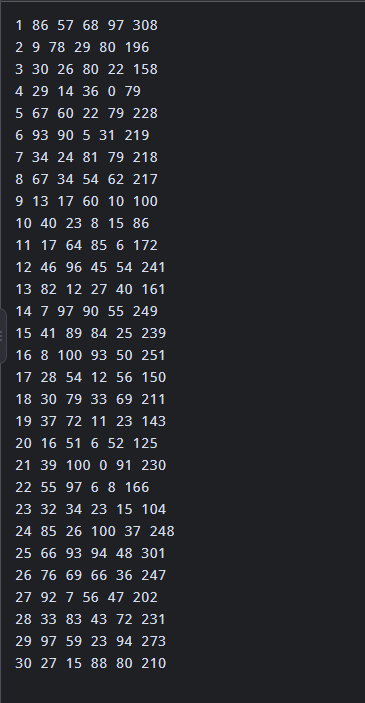
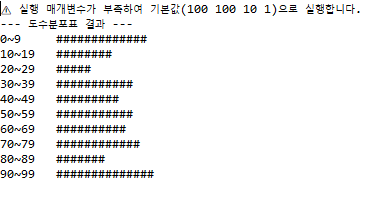

# Homework1
```java
public class Homework1 {
    public static void main(String[] args) {
        int size = 10; 

      
        System.out.println("");
        for (int i = 1; i <= size; i++) {
            for (int j = 1; j <= i; j++) {
                System.out.print("#");
            }
            System.out.println();
        }

        
        System.out.println("\n");
        for (int i = size; i >= 1; i--) {
            for (int j = 1; j <= i; j++) {
                System.out.print("#");
            }
            System.out.println();
        }

       
        System.out.println("\n");
        for (int i = 1; i <= size; i++) {
           
            for (int j = 1; j <= size - i; j++) {
                System.out.print(" ");
            }
            
            for (int k = 1; k <= i; k++) {
                System.out.print("#");
            }
            System.out.println();
        }

        
        System.out.println("\n");
        for (int i = size; i >= 1; i--) {
            
            for (int j = 1; j <= size - i; j++) {
                System.out.print(" ");
            }
           
            for (int k = 1; k <= i; k++) {
                System.out.print("#");
            }
            System.out.println();
        }
    }
}
```



# Homework2
```java
public class Homework2 {
    public static void main(String[] args) {
        int n = 20;
        long[] fib = new long[n];

        fib[0] = 1;
        fib[1] = 1;

        for (int i = 2; i<n;i++){
            fib[i] = fib[i-1]+fib[i-2];
        }

        System.out.println("");
        for(int i=0;i<n;i++){
            System.out.print(fib[i]+(i==n-1?"":","));
        }
        System.out.println();
    }
}


```


# Homework3
```java
public class Homework3 {
    public static void main(String[] args) {
        int n = 21; 
        long[] fib = new long[n + 1];
        
        fib[1] = 1;
        fib[2] = 1;
        
        for (int i = 3; i <= n; i++) {
            fib[i] = fib[i - 1] + fib[i - 2];
        }
        
        for (int i = 1; i <= 20; i++) {
            double ratio = (double) fib[i + 1] / fib[i];
            System.out.printf("%2d | %d / %d \t\t\t| %.15f%n", i, fib[i + 1], fib[i], ratio);
        }
    }
}

```



# Homework4
```java
public class Homework4 {
	public static void main(String[] args) {

		
		for(int i=1; i < 10; i++) {
			System.out.println(i + "단을 출력 합니다.");
            
  	         	
			for(int j=1; j < 10; j++) {
				System.out.println(i + " x " + j + " = " + i * j);
			}
			System.out.println();
		}	
	}
}

```


# Homework5
```java
public class homework5 {

    public static double calculatePiGregory(int iterations) {
        double pi = 0.0;
        for (int i = 0; i < iterations; i++) {
            double term = 4.0 / (2 * i + 1);
            
            if (i % 2 == 1) {
                pi -= term;
            } else {
                pi += term;
            }
        }
        return pi;
    }

    
    public static double calculatePiMadhava(int iterations) {
        double sum = 0.0;
        for (int k = 0; k < iterations; k++) {
            
            double term = Math.pow(-1.0 / 3.0, k) / (2 * k + 1);
            sum += term;
        }
        
        return Math.sqrt(12.0) * sum;
    }

    public static void main(String[] args) {
        System.out.println("=== 실제 정밀한 Math.PI 값 ===");
        System.out.println("Java Math.PI : " + Math.PI);
        System.out.println();

        System.out.println("=== 1. 그레고리-라이프니츠 급수 ===");       
        System.out.println("반복 10,000회  : " + calculatePiGregory(10000));
        System.out.println("반복 100,000회 : " + calculatePiGregory(100000));
        System.out.println();

        System.out.println("=== 2. 마다바 급수 ===");
        System.out.println("반복 10회      : " + calculatePiMadhava(10));
        System.out.println("반복 20회      : " + calculatePiMadhava(20));
    }
}

```


# Homework6
```java
public class homework6 {
    public static void main(String[] args) {
        int n = 7; 
        
        int[][] binomial = new int[n][];
        
        for (int i = 0; i < n; i++) {
            binomial[i] = new int[i + 1];
            
            for (int j = 0; j <= i; j++) {
                if (j == 0 || j == i) {
                    binomial[i][j] = 1;
                } else {
                    binomial[i][j] = binomial[i - 1][j - 1] + binomial[i - 1][j];
                }
            }
        }
        
        for (int i = 0; i < n; i++) {
            for (int j = 0; j <= i; j++) {
                System.out.print(binomial[i][j] + " ");
            }
            System.out.println(); 
        }
    }
}

```


# Homework7
```java
public class homework7 {
    public static void main(String[] args) {
        int data[] = new int[20];
        
        for (int i = 0; i < 20; i++) {
            data[i] = (int)(Math.random() * 100);
        }
        
        System.out.println("--- 정렬 전 ---");
        for (int i = 0; i < 20; i++) {
            System.out.print(data[i] + " ");
        }
        System.out.println("\n");

        for (int i = 0; i < 20 - 1; i++) {
            int minIndex = i; 
            
            for (int j = i + 1; j < 20; j++) {
                if (data[j] < data[minIndex]) {
                    minIndex = j;
                }
            }
            
            int temp = data[minIndex];
            data[minIndex] = data[i];
            data[i] = temp;
        }
        
        System.out.println("--- 정렬 후 (선택 정렬 완료) ---");
        for (int i = 0; i < 20; i++) {
            System.out.println(data[i]);
        }
    }
}


```


# Homework8
```java
public class homework8 {
    public static void main(String[] args) {
        int[][] score = new int[30][4];
        
        for (int i = 0; i < score.length; i++) {
            for (int j = 0; j < score[i].length; j++) {
                score[i][j] = (int) (Math.random() * 101);
            }
        }

        for (int i = 0; i < score.length; i++) {
            System.out.print((i + 1) + " ");
            
            int sum = 0; 
            
            for (int j = 0; j < score[i].length; j++) {
                System.out.print(score[i][j] + " ");
                sum += score[i][j];
            }
            
            System.out.println(sum);
        }
    }
}


```


# Homework10
```java
public class homework10 {
    public static void main(String[] args) {
        int arrayCount = 100;
        int maxValue = 100;
        int binSize = 10;
        int displayScale = 1;

        if (args.length >= 4) {
            arrayCount = Integer.parseInt(args[0]);
            maxValue = Integer.parseInt(args[1]);
            binSize = Integer.parseInt(args[2]);
            displayScale = Integer.parseInt(args[3]);
        } else {
            System.out.println("⚠️ 실행 매개변수가 부족하여 기본값(100 100 10 1)으로 실행합니다.");
        }

        int[] data = new int[arrayCount];
        for (int i = 0; i < data.length; i++) {
            data[i] = (int) (Math.random() * (maxValue + 1));
        }

        int binCount = maxValue / binSize;
        if (maxValue % binSize != 0) {
            binCount++;
        }
        int[] histogram = new int[binCount];

        for (int score : data) {
            if (score >= maxValue) {
                histogram[binCount - 1]++;
            } else {
                int binIndex = score / binSize;
                if (binIndex < binCount) {
                    histogram[binIndex]++;
                }
            }
        }

        System.out.println("--- 도수분포표 결과 ---");
        for (int i = 0; i < binCount; i++) {
            int start = i * binSize;
            int end = start + (binSize - 1);
            
            if (end > maxValue) end = maxValue;

            System.out.printf("%d~%d\t", start, end);

            int sharpCount = histogram[i] / displayScale;
            for (int j = 0; j < sharpCount; j++) {
                System.out.print("#");
            }
            System.out.println(); 
        }
    }
}


```


